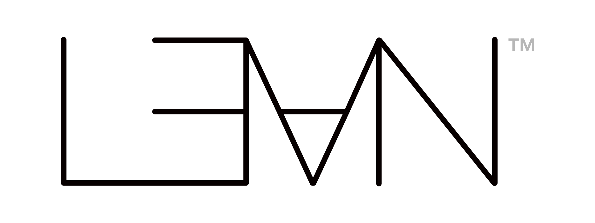
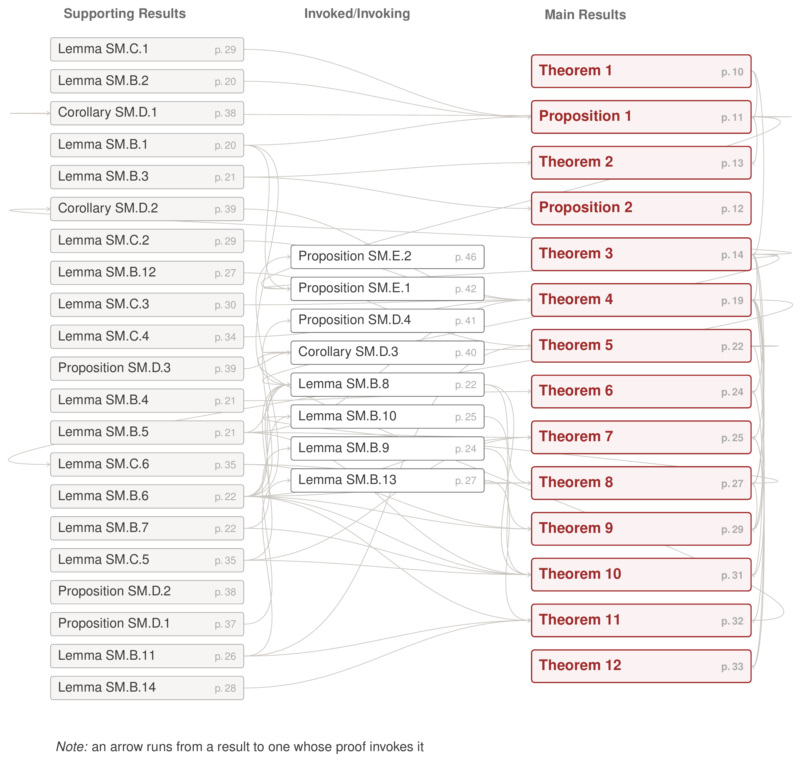

# Mundlak Regressions in Multiway Panels with Irregular Support: Failure, Repair, and Inference

<p align="center">
  
  
  
  
  
</p>

[Benjamin O. Harrison](https://benhars.com/),
[Gustavo Canavire Bacarreza](https://gcanavire.com/),
[David Jacho-Chavez](https://www.davidjachochavez.org) and
[Fernando Rios-Avila](https://friosavila.github.io/)

This development formalizes in <a href="https://lean-lang.org"><picture><source media="(prefers-color-scheme: dark)" srcset="assets/lean-logo-official-TM-white-2400x900.svg"></picture></a> 4, with Mathlib, the 43 labelled results of the
paper and its supplemental materials, each one stated and proved. There is no `sorry`, and
no declaration depends on an axiom other than `propext`, `Classical.choice` and `Quot.sound`.

The methods of the paper are implemented for Stata in
[`cre`](https://github.com/djachoc/cre-stata).

## Building

```
elan toolchain install $(cat lean-toolchain)
lake exe cache get
lake build
```

Lean is pinned in `lean-toolchain` and Mathlib in `lake-manifest.json`, so this is the build the
results were checked against. `lake exe cache get` downloads Mathlib's compiled artifacts and
takes a few minutes; without it `lake build` compiles Mathlib from source, which takes hours.
Only the first build is slow. Afterwards `lake build` recompiles an edited module and its
dependents.

## Verification

`lake build` checks that every file elaborates. It does not rule out a `sorry`, which elaborates
with a warning and leaves the build green. `Verify.lean` has one `#print axioms` directive
per public declaration and is run separately.

```
lake env lean Verify.lean
```

No declaration reports `sorryAx`, and no axiom appears outside the three named above. Seven
directives print under a name other than the one asked for, because `Multiway/Wald.lean`
re-exports them from `Multiway/Sqrt.lean` and `#print axioms` resolves an alias to the original.

## Finding a result

A result can span several modules, and a module can hold several results. Theorem 4 is spread
over eight modules. `Multiway/Sharing.lean` holds all five clauses of Lemma SM.B.11 together with
Proposition SM.D.3. Modules are named for the mathematics, not for the numbering of the paper.

[`results/map.tsv`](results/map.tsv) is the index, and [`results/README.md`](results/README.md)
is the same table rendered. Each row gives a printed result, the module that holds it and the
declarations that state its clauses. To read a result, open that module. Its header states what
the declarations prove. There are no per-result pages.

The figure below is drawn from the proofs in the manuscript and reads from left to right, from
supporting results to the main ones. Lemma SM.B.6 is invoked by nine other proofs and
Theorems 3 and 4 by six each; Theorem 1 invokes nothing. Its source is
[`results/proofmap.tex`](results/proofmap.tex).



## Layout

```
Multiway.lean            the root module, importing every file below
Multiway/                74 modules, and two directories
Multiway/SteinCLT/       8 ported modules, the Stein-method chain
Multiway/BrownCLT/       4 ported modules
Verify.lean              one #print axioms directive per public declaration
results/map.tsv          the index, one row per printed result
results/README.md        the same table rendered
results/proofmap.png     the figure above, with proofmap.tex its source
assets/                  the Lean wordmark, as published by Lean FRO
LICENSE, NOTICE          Apache 2.0 and the attribution it requires
lean-toolchain           the pinned Lean version
lake-manifest.json       the pinned Mathlib revision
```

## Reading the statements

Each Lean statement transcribes a printed one. Some hypotheses
are measurability or nonemptiness conditions that the paper leaves implicit. Where the paper
writes convergence in probability, a few statements give almost everywhere convergence along a
realization of the conditioning variables. A handful of results are exercised on a model that
holds one index at one, so the matrix algebra is not tested by that example.

Each result is also exhibited on a concrete model, by a declaration whose name ends in `_witness`
and proves that its hypotheses hold together. A theorem with contradictory hypotheses compiles
and proves nothing, and these declarations rule that out.

Two results from outside the paper are formalized here because its proofs use them. Theorem 2 of
Janson (1988, p. 307), the central limit theorem for sums over a dependency graph, is in
`Multiway/JansonCLT.lean` with his Theorem 1 and Lemmas 1 to 4. Janson states Remark 3, which
extends the theorem to unbounded summands by truncation, without proof. The paper does not use
it: the proof of Theorem 5(b) truncates the summands itself and applies Theorem 2 to the truncated
array, and that argument is formalized in `Multiway/ClusterJansonB.lean`. Marcinkiewicz's
Théorème 2 bis is in `Multiway/Marcinkiewicz.lean`.

## Ported modules

Nine modules come from CausalSmith, the
[`Causalean`](https://github.com/Jiyuan-Tan/CausalSmith) library of Jiyuan Tan, under the Apache
License 2.0. Eight of them are the Stein-method central limit theorem for dependency graphs in
`Multiway/SteinCLT/`, and `Multiway/Cumulant.lean` comes from that library's moment-problem file.
Each has the notice the license requires, naming the upstream path and the changes made.
Those changes are re-rooted imports and one repair for a Mathlib rename. No upstream declaration
name, namespace or attribution was altered.

## Citation

```bibtex
@unpublished{HarrisonEtAl2026_mundlak,
  author = {Harrison, Benjamin O. and Canavire Bacarreza, Gustavo and Jacho-Chavez, David T. and Rios-Avila, Fernando},
  title  = {Mundlak regressions in multiway panels with irregular support: Failure, repair, and inference},
  note   = {Unpublished manuscript},
  year   = {2026}
}
```

Janson, S. (1988). Normal convergence by higher semiinvariants with applications to sums of
dependent random variables and random graphs. *The Annals of Probability* 16(1), 305-312.
[doi:10.1214/aop/1176991903](https://doi.org/10.1214/aop/1176991903)

Marcinkiewicz, J. (1939). Sur une propriete de la loi de Gauss. *Mathematische Zeitschrift* 44,
612-618. [doi:10.1007/BF01210677](https://doi.org/10.1007/BF01210677)

The Mathlib Community (2020). The Lean mathematical library. *CPP 2020*, 367-381.
[doi:10.1145/3372885.3373824](https://doi.org/10.1145/3372885.3373824)

## Authors

- [Benjamin O. Harrison](https://benhars.com/), Department of Economics, Emory University, Rich
  Building 306, 1602 Fishburne Dr., Atlanta, GA 30322-2240, USA
- [Gustavo Canavire Bacarreza](https://gcanavire.com/), World Bank, 1818 H Street NW, Washington,
  DC 20433, USA, and Universidad Privada Boliviana, Bolivia
- [David Jacho-Chavez](https://www.davidjachochavez.org) (corresponding author), Department of
  Economics, Emory University, Rich Building 306, 1602 Fishburne Dr., Atlanta, GA 30322-2240, USA
- [Fernando Rios-Avila](https://friosavila.github.io/), Universidad Privada Boliviana, La Paz,
  Bolivia, and London School of Economics and Political Science, London, United Kingdom

## License

Apache License 2.0, as in [LICENSE](LICENSE). Mathlib and the ported modules are under the same
license, which allows results from here to be ported into other developments with attribution.
