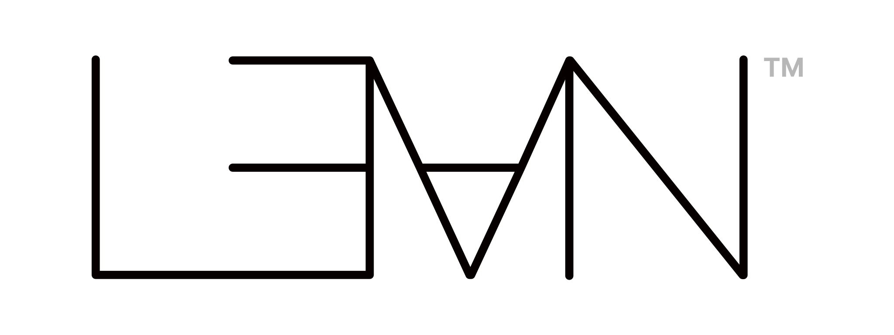
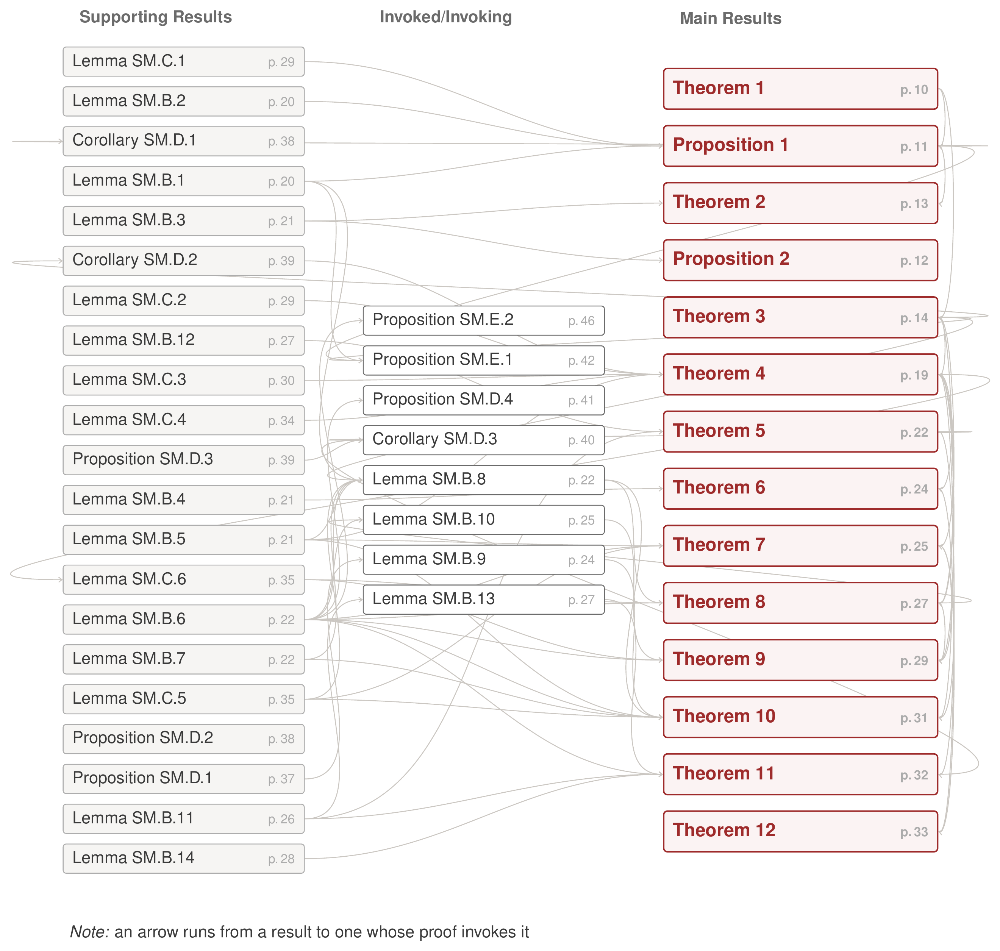

# Mundlak Regressions in Multiway Panels with Irregular Support: Failure, Repair, and Inference

<p align="center">
  
  
  
  
  
</p>

[Benjamin O. Harrison](https://benhars.com/),
[Gustavo Canavire Bacarreza](https://gcanavire.com/),
[David Jacho-Chavez](https://www.davidjachochavez.org) and
[Fernando Rios-Avila](https://friosavila.github.io/)

This development formalizes in <a href="https://lean-lang.org"><picture><source media="(prefers-color-scheme: dark)" srcset="assets/lean-logo-official-TM-white-2400x900.svg"></picture></a> 4, with Mathlib, the 43 labelled results of the
paper and its supplemental materials, each one stated and proved. There is no [`sorry`](https://lean-lang.org/doc/reference/latest/Tactic-Proofs/Tactic-Reference/#sorry),
and no declaration depends on an axiom other than [`propext`](https://lean-lang.org/theorem_proving_in_lean4/Axioms-and-Computation/#propositional-extensionality),
[`Classical.choice`](https://lean-lang.org/theorem_proving_in_lean4/Axioms-and-Computation/#choice) and [`Quot.sound`](https://lean-lang.org/theorem_proving_in_lean4/Axioms-and-Computation/#quotients).

The methods of the paper are implemented for Stata in
[`cre`](https://github.com/djachoc/cre-stata).

## Building

```
elan toolchain install $(cat lean-toolchain)
lake exe cache get
lake build
```

Lean is pinned in [`lean-toolchain`](lean-toolchain) and Mathlib in [`lake-manifest.json`](lake-manifest.json), so this is the build the
results were checked against. `lake exe cache get` downloads Mathlib's compiled artifacts and
takes a few minutes; without it `lake build` compiles Mathlib from source, which takes hours.
After the first build, `lake build` recompiles only an edited module and its dependents.

## Verification

`lake build` checks that every file elaborates. It does not rule out a `sorry`, which elaborates
with a warning and leaves the build green. [`Verify.lean`](Verify.lean) has one [`#print axioms`](https://lean-lang.org/doc/reference/latest/ValidatingProofs/#validating-printing-axioms)
directive per public declaration and is run separately.

```
lake env lean Verify.lean
```

No declaration reports [`sorryAx`](https://leanprover-community.github.io/mathlib4_docs/Init/Prelude.html#sorryAx), and no axiom appears outside the three named above. Seven
directives print under a name other than the one asked for, because [`Multiway/Wald.lean`](Multiway/Wald.lean)
re-exports them from [`Multiway/Sqrt.lean`](Multiway/Sqrt.lean) and `#print axioms` resolves an alias to the original.

> **For readers new to Lean**
>
> Lean accepts a proof only when every step follows from its rules of logic and from a short
> list of axioms, the basic facts that are assumed rather than proved. `#print axioms` lists the
> axioms a result depends on.
>
> The word `sorry` marks a step that has not been proved. Lean accepts it with a warning and
> records it as an axiom named `sorryAx`, so a result with an unproved step shows `sorryAx` in
> that list. None of the results here does.
>
> `propext`, `Classical.choice` and `Quot.sound` are the three axioms of Lean's standard logic,
> used by Mathlib and by almost every development built on it. `propext` says that two
> statements that are logically equivalent, each implying the other, can replace each other
> anywhere. `Classical.choice` is the axiom of choice: from any collection known to have a
> member, one member can be picked, even when no rule says which. `Quot.sound` says that when
> objects are grouped into classes, as the fractions 1/2 and 2/4 are treated as one number,
> two objects in the same class are equal. Together these three give ordinary mathematics,
> classical logic with the axiom of choice, so a result that depends only on them is proved from
> the same foundations as a result in a textbook.

## Finding a result

A result can span several modules, and a module can hold several results. Theorem 4 is spread
over eight modules. [`Multiway/Sharing.lean`](Multiway/Sharing.lean) holds all five clauses of Lemma SM.B.11 together with
Proposition SM.D.3. Modules are named after their mathematical content.

[`results/map.tsv`](results/map.tsv) is the index, and [`results/README.md`](results/README.md)
is the same table rendered. Each row gives a printed result, the module that holds it and the
declarations that state its clauses. To read a result, open that module. Its header states what
the declarations prove.

The figure below is drawn from the proofs in the manuscript and reads from left to right, from
supporting results to the main ones. Lemma SM.B.6 is invoked by nine other proofs and
Theorems 3 and 4 by six each; Theorem 1 invokes nothing. Its source is
[`results/proofmap.tex`](results/proofmap.tex).



## Layout

```
Multiway.lean            the root module, importing every file below
Multiway/                74 modules, and two directories
Multiway/SteinCLT/       8 ported modules, the Stein-method chain
Multiway/BrownCLT/       4 ported modules, the Brown martingale central limit theorem
Verify.lean              one #print axioms directive per public declaration
results/map.tsv          the index, one row per printed result
results/README.md        the same table rendered
results/proofmap.png     the figure above, with proofmap.tex its source
assets/                  the Lean wordmark, as published by Lean FRO
LICENSE, NOTICE          Apache 2.0 and the attribution it requires
lean-toolchain           the pinned Lean version
lake-manifest.json       the pinned Mathlib revision
```

## Reading the statements

Each Lean statement restates a result as it is printed in the paper or its supplemental
materials. Some hypotheses are measurability or nonemptiness conditions that the paper leaves implicit. Where the paper
writes convergence in probability, a few statements give almost everywhere convergence along a
realization of the conditioning variables.

Each result is also applied to an explicit example, in a declaration whose name ends in
`_witness`: every object in the hypotheses is given a specific value, and the declaration proves
that all the hypotheses hold together. Lean would also accept a theorem whose hypotheses cannot
all hold at once, and such a theorem would apply to no case. In a few examples one dimension is
set to one (one regressor, one observation, or identity matrices), which shows that the
hypotheses are consistent but does not exercise the matrix algebra.

Two results from outside the paper are formalized here because its proofs use them. Theorem 2 of
Janson (1988, p. 307), the central limit theorem for sums over a dependency graph, is in
[`Multiway/JansonCLT.lean`](Multiway/JansonCLT.lean) with his Theorem 1 and Lemmas 1 to 4. Janson states Remark 3, which
extends the theorem to unbounded summands by truncation, without proof. The paper does not use
it: the proof of Theorem 5(b) truncates the summands itself and applies Theorem 2 to the truncated
array, and that argument is formalized in [`Multiway/ClusterJansonB.lean`](Multiway/ClusterJansonB.lean). Marcinkiewicz's
Théorème 2 bis is in [`Multiway/Marcinkiewicz.lean`](Multiway/Marcinkiewicz.lean).

## Ported modules

Nine modules come from CausalSmith, the
[Causalean](https://github.com/Jiyuan-Tan/CausalSmith) library of Jiyuan Tan, under the Apache
License 2.0. Eight of them are the Stein-method central limit theorem for dependency graphs in
[`Multiway/SteinCLT/`](Multiway/SteinCLT), and [`Multiway/Cumulant.lean`](Multiway/Cumulant.lean) comes from that library's moment-problem file.
Each begins with the notice the license requires, which names the original file and the changes
made to it. In the eight Stein-method modules the changes are the paths of the imported files and
one repair after a lemma was renamed in Mathlib, and no name, namespace or attribution of the
original was altered. [`Multiway/Cumulant.lean`](Multiway/Cumulant.lean) takes only the form of one definition from that
library; the rest of the file was written here.

Four modules come from [Stat-Lean](https://github.com/StatLean/Stat-Lean), the Lean 4
formalization of statistical theory, copyright 2024 Junwei Lu, under the Apache License 2.0. They are the Brown martingale central
limit theorem in [`Multiway/BrownCLT/`](Multiway/BrownCLT). Each begins with the notice the license requires, which
names the original file and the changes made to it. The changes are the paths of the imported
files, repairs to proofs that no longer compiled under the newer Mathlib, and shorter
explanatory comments.

## Citation

```bibtex
@unpublished{HarrisonEtAl2026_mundlak,
  author = {Harrison, Benjamin O. and
            Canavire Bacarreza, Gustavo and
            Jacho-Chavez, David T. and
            Rios-Avila, Fernando},
  title  = {Mundlak regressions in multiway panels with irregular support:
            Failure, repair, and inference},
  note   = {Unpublished manuscript. Every result is formalized and
            checked in Lean 4 at
            \url{https://github.com/djachoc/multiway-mundlak-lean}},
  year   = {2026}
}
```

Janson, S. (1988). Normal convergence by higher semiinvariants with applications to sums of
dependent random variables and random graphs. *The Annals of Probability* 16(1), 305-312.
[doi:10.1214/aop/1176991903](https://doi.org/10.1214/aop/1176991903)

Marcinkiewicz, J. (1939). Sur une propriete de la loi de Gauss. *Mathematische Zeitschrift* 44,
612-618. [doi:10.1007/BF01210677](https://doi.org/10.1007/BF01210677)

The Mathlib Community (2020). The Lean mathematical library. *CPP 2020*, 367-381.
[doi:10.1145/3372885.3373824](https://doi.org/10.1145/3372885.3373824)

## Authors

- [Benjamin O. Harrison](https://benhars.com/), Department of Economics, Emory University, Rich
  Building 306, 1602 Fishburne Dr., Atlanta, GA 30322-2240, USA
- [Gustavo Canavire Bacarreza](https://gcanavire.com/), World Bank, 1818 H Street NW, Washington,
  DC 20433, USA, and Universidad Privada Boliviana, Bolivia
- [David Jacho-Chavez](https://www.davidjachochavez.org) (corresponding author), Department of
  Economics, Emory University, Rich Building 306, 1602 Fishburne Dr., Atlanta, GA 30322-2240, USA
- [Fernando Rios-Avila](https://friosavila.github.io/), Universidad Privada Boliviana, La Paz,
  Bolivia, and London School of Economics and Political Science, London, United Kingdom

## License

Apache License 2.0, as in [LICENSE](LICENSE). Mathlib and the ported modules are under the same
license, which allows results from here to be ported into other developments with attribution.
